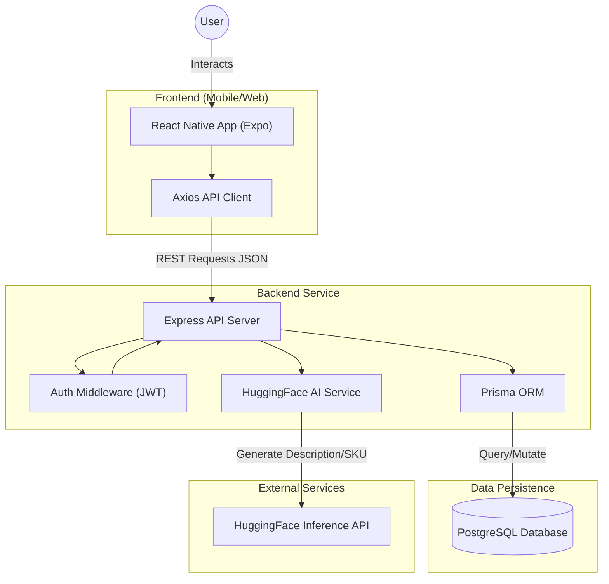

# Knot and Bloom Documentation

## 1. Project Overview

**Knot and Bloom** is a multi-vendor marketplace platform dedicated to handcrafted goods. It connects independent artisans (Sellers) with buyers (Customers) in a unified mobile and web experience.

### Business Model

- **Commission**: The platform creates a revenue stream by taking a percentage commission on every sale.
- **Direct-to-Consumer**: Sellers manage their own inventory and shipping, while the platform handles discovery, payments, and trust.

### User Types

- **Customer**: Browses products, manages cart, places orders, and tracks shipments.
- **Seller**: A Customer who has onboarded to sell. Manages products, views orders, and tracks earnings.
- **Admin**: Platform oversight. Approves new sellers and products, manages global settings.

## 2. Getting Started

### Prerequisites

- Node.js (v18+)
- PostgreSQL (Local or Cloud)
- Expo CLI (`npm install -g expo-cli`)

### Quick Start (Local Dev)

1.  **Backend Setup**:
    ```bash
    cd backend
    npm install
    cp .env.example .env # Configure DB URL
    npx prisma migrate dev
    npm run dev
    ```
2.  **Frontend Setup**:
    ```bash
    # New Terminal
    npm install
    npx expo start
    ```
3.  **Seed Data**:
    - Currently manual via `npx prisma studio` or via `scripts/seed.ts` (if available).

### Running Tests

- Backend: `npm test` (Runs Jest unit tests for services)
- Frontend: `npm run test` (Runs Jest/RNTL component tests)

## 3. Architecture

### High-Level Diagram



### Data Flow

1.  **Client**: Expo app uses `axios` with JWT auth headers.
2.  **Server**: Express routes -> Controllers -> Services -> Prisma.
3.  **Database**: PostgreSQL relationally stores all business data.

## 4. Business Logic & Core Flows

### 4.1 Order Lifecycle

The status of an order (`OrderStatus`) progresses as follows:

1.  **PENDING**: Order record created via atomic transaction in `CheckoutController`. Payment is confirmed.
2.  **CONFIRMED**: (Optional step if manual verification needed, otherwise usually skips to Processing).
3.  **PROCESSING**: Seller acknowledges order and begins packing.
4.  **SHIPPED**: Seller marks item as shipped and provides tracking.
5.  **DELIVERED**: Carrier update or customer confirmation.
6.  _Alternative_: **CANCELLED** (by User/Seller before shipping) or **REFUNDED**.

### 4.2 Seller Onboarding

1.  **Register**: User signs up as Customer.
2.  **Apply**: User submits Seller Application (Business Name, Tax ID). Status -> `PENDING`.
3.  **Approval**: Admin reviews application. Status -> `ACTIVE`.
4.  **Selling**: User can now access Seller Dashboard and post products.

### 4.3 Product Approval

To maintain quality, products are not instantly public.

1.  **Draft**: Seller saves work-in-progress.
2.  **Pending**: Seller publishes. Product is visible to Admin but not public.
3.  **Active**: Admin approves product. It now appears in search and categories.

## 5. Backend Architecture

### File Structure

```
backend/src/
├── controllers/    # Request handlers. Validates input, calls services, sends response.
├── services/       # Business logic layer. Pure functions where possible.
│   ├── GenerateService.ts   # HuggingFace AI integration
│   ├── CheckoutService.ts   # State machine logic
│   └── AuthService.ts       # Token generation
├── middleware/     # Express middleware (Auth, Validation, Error Handling)
├── routes/         # Router definitions
├── types/          # TypeScript interfaces
└── utils/          # Helpers (Prisma client, Maths)
```

### Separation of Concerns

- **Controllers**: Handle HTTP. Don't put complex logic here.
- **Services**: Handle Business Logic. Decoupled from HTTP req/res objects. Testable.
- **Prisma**: Handles Data Access.

## 6. Frontend Architecture

### File Structure (Expo Router)

```
app/
├── (tabs)/         # Main bottom tab navigator (Home, Search, Cart, Profile)
├── (auth)/         # Login/Register screens (modal or stack)
├── product/        # Product Details pages
├── seller/         # Seller Dashboard feature module
├── components/     # Shared UI components (Buttons, Cards)
├── context/        # Global State providers
└── api/            # Network layer
```

### Key Components

- **AuthContext**: Manages User session, JWT in AsyncStorage, and Loading states.
- **CartContext**: Manages local cart state, syncs with Backend on change.
- **Axios Interceptor (`api/api.ts`)**: Automatically attaches Bearer tokens and handles global 401 (Logout) events.

## 7. Database Schema

### Key Models

- **Product**: Central entity. Uniquely identified by `sku`.
- **ProductVariant**: Represents sizes/colors. Has unique `sku`.
  - _Constraint_: `Unique([productId, name])`.
- **Order**: A completed transaction.
  - _Index_: `idempotencyKey` (Unique) for payment safety.
- **Seller**: Profile for a vendor.
  - _Index_: `slug` for custom shop URLs.

### Cascade Utilities

- **Customer Delete**: Cascades to `Address`, `Cart`. `Order`s are usually kept (set NULL) for records, or strict prevention.
- **Product Delete**: Soft delete (`deletedAt`) preferred over hard delete to preserve Order history.

## 8. Authentication & Security

### Roles (RBAC)

- **USER**: Default.
- **SELLER**: Can access `/seller` routes.
- **ADMIN**: Can access `/admin` routes.

### Security Implementation

- **JWT**: Stateless auth. Access Token (1h), Refresh Token (7d).
- **Passwords**: Hashed securely (Bcrypt/Argon2).
- **Middleware**: `authorize([Role.ADMIN])` protects sensitive routes.

## 9. Checkout State Machine

The Checkout Flow is a strict State Machine to prevent race conditions and stock errors.

### Phases

1.  **INITIATE**: Lock prices into a snapshot. Create specific `CheckoutSession`.
2.  **VALIDATE**: Check stock _again_ just before payment.
3.  **PAYMENT**: Process charge. Failing here -> `AWAITING_PAYMENT` (retry) or `FAILED`.
4.  **COMPLETE**: Atomic DB transaction. Decrement Stock, Create Order, Delete Cart.

### Concurrency Control

- **Optimistic Locking**: We verify stock quantity `<=` available in the final `prisma.$transaction`. If stock changed since validation, the transaction aborts.

### Failure Modes

- **Timeout**: Session expires in 15 mins. Stock is never "held" until final purchase, only validated.
- **Payment Failure**: Returns error to UI. User can retry with different card.
- **Idempotency Collision**: Returns original response without re-processing.

## 10. API Reference

**Base URL**: `http://localhost:3030/api`

### Response Standard

```json
{
  "success": true, // or false
  "data": { ... }, // Payload
  "error": "ERROR_CODE", // if success=false
  "message": "Human readable details"
}
```

### Core Endpoints

- `POST /auth/login`
- `GET /products` (Public)
- `POST /checkout/initiate` (User)
- `POST /checkout/:id/complete` (User)

## 11. Third-Party Integrations

- **AI**: **HuggingFace Inference API** for generating descriptions and SEO tags.
- **Storage**: Images currently stored locally (uploads dir). _Plan: Migrate to AWS S3/Cloudinary_.
- **Payment**: Currently Mocked. _Plan: Stripe or PayMongo_. Webhooks required for async success.

## 12. Error Handling

### Strategy

1.  **Database**: Prisma throws specific codes (P2002 for uniqueness).
2.  **Service**: Catches DB errors, wraps in semantic AppErrors (`DuplicateEntityError`).
3.  **Controller**: Catches AppError, formats standard JSON response (400/404/500).
4.  **Frontend**: Axios interceptor catches 4xx/5xx. Displays Toast for active errors, standard UI for 404s.

### Logging

- **Dev**: Console logging (verbose).
- **Prod**: _To Be Implemented (Sentry/Datadog)._

## 13. Testing Strategy

- **Unit**: Test `CalculateDiscount` and `GenerateService` logic in isolation.
- **Integration**: Test `CheckoutController` flows with a test DB.
- **Critical Scenarios**:
  - Stock reaches 0 during checkout.
  - Concurrent checkout attempts for last item.
  - Invalid permissions for Admin routes.

## 14. Deployment & DevOps

- **Backend**: Dockerized Node.js app. Host on Render/Railway.
- **Database**: Managed PostgreSQL (Neon/Supabase/AWS RDS).
- **Mobile**: Expo EAS Build (submit to App Store/Play Store).
- **CI/CD**: GitHub Actions to run tests on PR push.

## 15. Known Issues / Tech Debt

1.  **Synchronous Payments**: Real gateways need async webhooks.
2.  **Search**: Currently basic SQL `LIKE`. Needs Full Text Search (ElasticSearch/Algolia).
3.  **Image Hosting**: Local storage is not production ready.

## 16. Troubleshooting

- **"Prisma Client not initialized"**: Run `npx prisma generate`.
- **"Connection refused"**: Check `DATABASE_URL` in `.env`.
- **"Network Error" on Android**: Ensure backend is running on host IP, not `localhost`.
